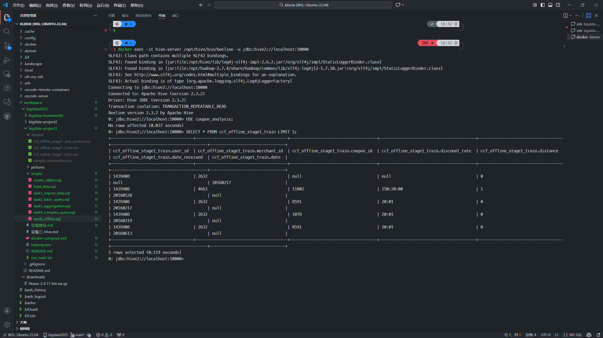
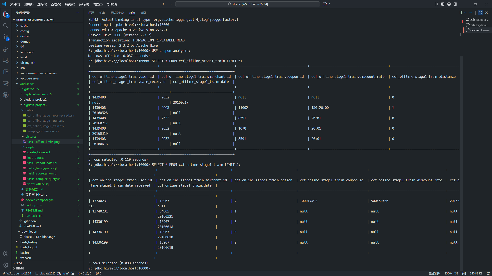
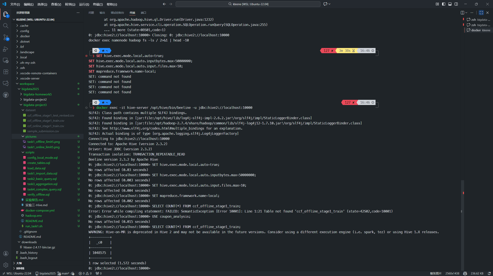
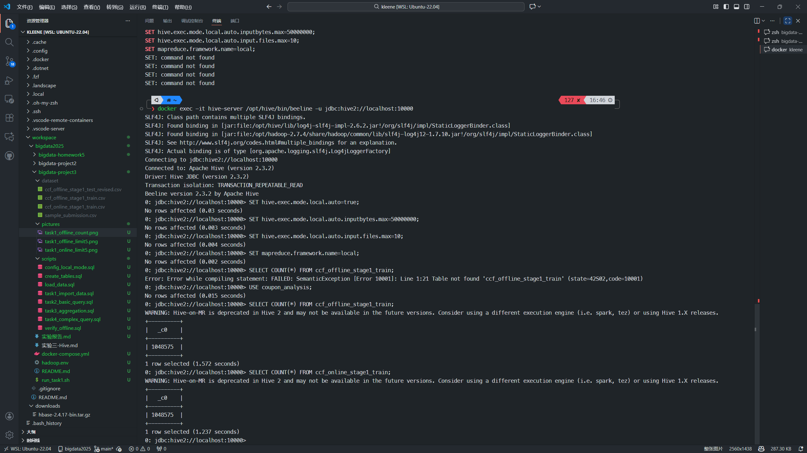
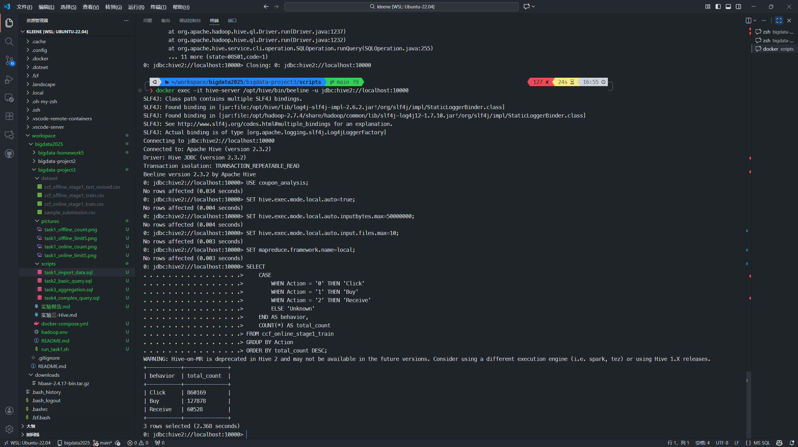
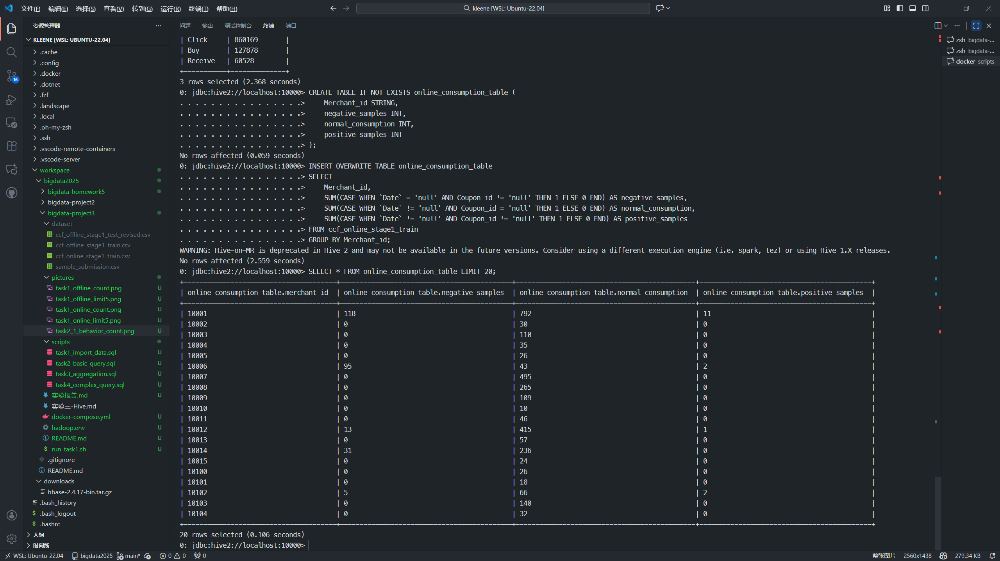
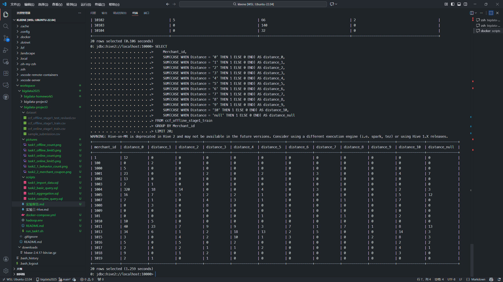
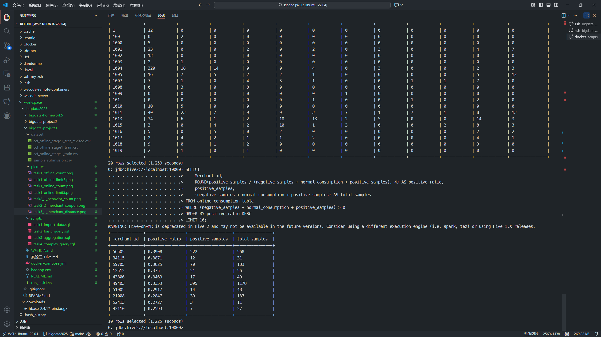
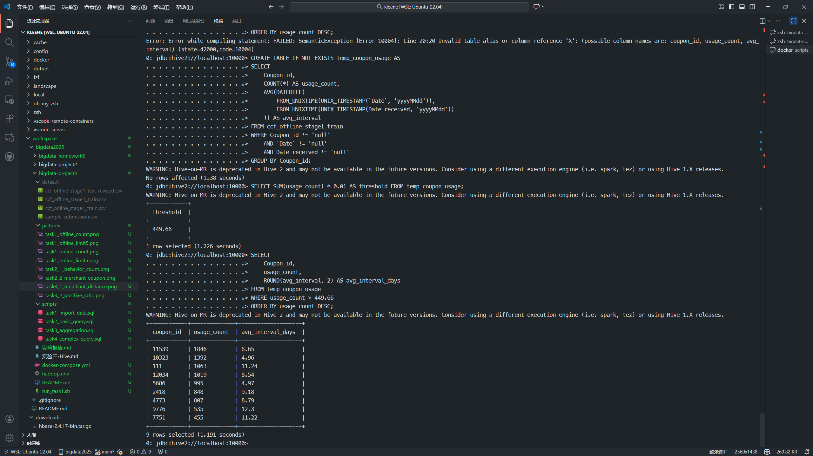
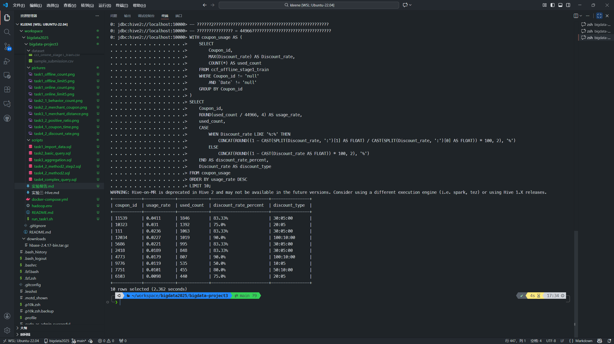

# 实验3：基于Hive的优惠券使用数据分析

**姓名**：  彭煌
**学号**：  231275035
**日期**：2025年11月13日

---

## 一、实验目的

1. 掌握Hive的基本操作，包括创建表、导入数据等
2. 熟悉HiveQL查询语法，完成数据统计与分析任务
3. 理解Hive在大数据场景下的应用，体会其在数据仓库中的作用
4. 通过实际案例分析优惠券使用行为，提升数据分析能力

---

## 二、实验环境

- 操作系统：Linux
- Hive版本：2.3.2
- Hadoop版本：2.7.4
- 部署方式：Docker Compose (bde2020镜像)
- 数据集：
  - ccf_offline_stage1_train.csv (线下消费数据，1,048,575条记录)
  - ccf_online_stage1_train.csv (线上消费数据)

---

## 三、实验内容与结果

### 任务一：导入数据

#### 1.1 创建数据库和表

创建实验所需的数据库：

```sql
CREATE DATABASE IF NOT EXISTS coupon_analysis;
USE coupon_analysis;
```

#### 1.2 创建线下消费表

根据CSV文件结构创建内部表 `ccf_offline_stage1_train`。注意：由于 `Date` 是Hive的保留字，需要使用反引号包围：

```sql
CREATE TABLE IF NOT EXISTS ccf_offline_stage1_train (
    User_id STRING,
    Merchant_id STRING,
    Coupon_id STRING,
    Discount_rate STRING,
    Distance STRING,
    Date_received STRING,
    `Date` STRING
)
ROW FORMAT DELIMITED
FIELDS TERMINATED BY ','
STORED AS TEXTFILE
TBLPROPERTIES ('skip.header.line.count'='1');
```

#### 1.3 创建线上消费表

根据CSV文件结构创建内部表 `ccf_online_stage1_train`：

```sql
CREATE TABLE IF NOT EXISTS ccf_online_stage1_train (
    User_id STRING,
    Merchant_id STRING,
    Action STRING,
    Coupon_id STRING,
    Discount_rate STRING,
    Date_received STRING,
    `Date` STRING
)
ROW FORMAT DELIMITED
FIELDS TERMINATED BY ','
STORED AS TEXTFILE
TBLPROPERTIES ('skip.header.line.count'='1');
```

#### 1.4 配置Hive本地模式

为了在单机环境中执行聚合查询，配置Hive使用本地模式：

```sql
SET hive.exec.mode.local.auto=true;
SET hive.exec.mode.local.auto.inputbytes.max=50000000;
SET hive.exec.mode.local.auto.input.files.max=10;
SET mapreduce.framework.name=local;
```

#### 1.5 加载数据

将CSV文件加载到对应的Hive表中：

```sql
LOAD DATA LOCAL INPATH '/dataset/ccf_offline_stage1_train.csv' 
INTO TABLE ccf_offline_stage1_train;

LOAD DATA LOCAL INPATH '/dataset/ccf_online_stage1_train.csv' 
INTO TABLE ccf_online_stage1_train;
```

#### 1.6 验证数据加载

查询前5条记录验证数据加载成功：

```sql
SELECT * FROM ccf_offline_stage1_train LIMIT 5;
```

**执行结果截图**：



```sql
SELECT * FROM ccf_online_stage1_train LIMIT 5;
```

**执行结果截图**：



统计记录总数：

```sql
SELECT COUNT(*) FROM ccf_offline_stage1_train;
```

**执行结果截图**：



```sql
SELECT COUNT(*) FROM ccf_online_stage1_train;
```

**执行结果截图**：



---

### 任务二：基本数据查询

#### 2.1 查询用户行为数量

统计线上数据中三种行为（点击、购买、领取）的总次数，按数量降序排列。为避免字符编码问题，使用英文标签：

```sql
SELECT 
    CASE 
        WHEN Action = '0' THEN 'Click'
        WHEN Action = '1' THEN 'Buy'
        WHEN Action = '2' THEN 'Receive'
        ELSE 'Unknown'
    END AS behavior,
    COUNT(*) AS total_count
FROM ccf_online_stage1_train
GROUP BY Action
ORDER BY total_count DESC;
```

**查询结果说明：**
- Click (点击)：860,169 次
- Buy (购买)：127,878 次
- Receive (领取)：60,528 次

**执行结果截图**：



#### 2.2 查询商家优惠券使用情况

创建新表存储商家优惠券使用统计结果：

```sql
CREATE TABLE IF NOT EXISTS online_consumption_table (
    Merchant_id STRING,
    negative_samples INT,
    normal_consumption INT,
    positive_samples INT
);
```

统计每个商家的优惠券使用情况并插入新表（注意Date是保留字需要用反引号）：

```sql
INSERT OVERWRITE TABLE online_consumption_table
SELECT 
    Merchant_id,
    SUM(CASE WHEN `Date` = 'null' AND Coupon_id != 'null' THEN 1 ELSE 0 END) AS negative_samples,
    SUM(CASE WHEN `Date` != 'null' AND Coupon_id = 'null' THEN 1 ELSE 0 END) AS normal_consumption,
    SUM(CASE WHEN `Date` != 'null' AND Coupon_id != 'null' THEN 1 ELSE 0 END) AS positive_samples
FROM ccf_online_stage1_train
GROUP BY Merchant_id;
```

查询统计结果：

```sql
SELECT * FROM online_consumption_table LIMIT 20;
```

**执行结果截图**：



---

### 任务三：数据聚合分析

#### 3.1 商家周边活跃顾客数量统计

统计每个商家在不同距离范围内的活跃消费者人数：

```sql
SELECT 
    Merchant_id,
    SUM(CASE WHEN Distance = '0' THEN 1 ELSE 0 END) AS distance_0,
    SUM(CASE WHEN Distance = '1' THEN 1 ELSE 0 END) AS distance_1,
    SUM(CASE WHEN Distance = '2' THEN 1 ELSE 0 END) AS distance_2,
    SUM(CASE WHEN Distance = '3' THEN 1 ELSE 0 END) AS distance_3,
    SUM(CASE WHEN Distance = '4' THEN 1 ELSE 0 END) AS distance_4,
    SUM(CASE WHEN Distance = '5' THEN 1 ELSE 0 END) AS distance_5,
    SUM(CASE WHEN Distance = '6' THEN 1 ELSE 0 END) AS distance_6,
    SUM(CASE WHEN Distance = '7' THEN 1 ELSE 0 END) AS distance_7,
    SUM(CASE WHEN Distance = '8' THEN 1 ELSE 0 END) AS distance_8,
    SUM(CASE WHEN Distance = '9' THEN 1 ELSE 0 END) AS distance_9,
    SUM(CASE WHEN Distance = '10' THEN 1 ELSE 0 END) AS distance_10,
    SUM(CASE WHEN Distance = 'null' THEN 1 ELSE 0 END) AS distance_null
FROM ccf_offline_stage1_train
GROUP BY Merchant_id
LIMIT 20;
```

**执行结果截图**：



#### 3.2 商家正样本比例统计

统计正样本比例最高的前十个商家：

```sql
SELECT 
    Merchant_id,
    ROUND(positive_samples / (negative_samples + normal_consumption + positive_samples), 4) AS positive_ratio,
    positive_samples,
    (negative_samples + normal_consumption + positive_samples) AS total_samples
FROM online_consumption_table
WHERE (negative_samples + normal_consumption + positive_samples) > 0
ORDER BY positive_ratio DESC
LIMIT 10;
```

**执行结果截图**：



---

### 任务四：复杂查询与分析

#### 4.1 优惠券使用时间统计

统计使用次数大于总使用次数1%的优惠券，计算从领取到使用的平均间隔。由于Hive 2.3对子查询支持有限，采用临时表方式实现。

**步骤1：创建临时表存储优惠券使用统计**

```sql
CREATE TABLE IF NOT EXISTS temp_coupon_usage AS
SELECT 
    Coupon_id,
    COUNT(*) AS usage_count,
    AVG(DATEDIFF(
        FROM_UNIXTIME(UNIX_TIMESTAMP(`Date`, 'yyyyMMdd')),
        FROM_UNIXTIME(UNIX_TIMESTAMP(Date_received, 'yyyyMMdd'))
    )) AS avg_interval
FROM ccf_offline_stage1_train
WHERE Coupon_id != 'null' 
    AND `Date` != 'null' 
    AND Date_received != 'null'
GROUP BY Coupon_id;
```

**步骤2：计算总使用次数的1%作为阈值**

```sql
SELECT SUM(usage_count) * 0.01 AS threshold FROM temp_coupon_usage;
```

查询结果：阈值为 **449.66**

**步骤3：查询超过阈值的优惠券**

```sql
SELECT 
    Coupon_id,
    usage_count,
    ROUND(avg_interval, 2) AS avg_interval_days
FROM temp_coupon_usage
WHERE usage_count > 449.66
ORDER BY usage_count DESC;
```

**执行结果截图**：



**结果说明**：
- 共有9个优惠券的使用次数超过总使用次数的1%
- 优惠券11539使用次数最多（1846次），平均间隔8.65天
- 平均使用间隔在4.96天到12.30天之间

#### 4.2 优惠券折扣率统计

统计使用率前十的优惠券及其折扣率。

**字段理解说明**：
实验要求中"统计每一种优惠券的被使用率（使用次数 / 总消费次数），`Coupon_id` 缺失项不计入总使用次数"存在两种理解方式：

- **理解1**：总消费次数 = 所有消费记录（包括使用优惠券和不使用优惠券的消费）
- **理解2**：总消费次数 = 仅使用了优惠券的消费记录（`Coupon_id` 缺失项不计入）

为保证实验完整性，我们分别按两种理解方式实现。

---

**方法一：总消费次数包括所有消费记录**

**概念说明**：
- **使用次数**：该优惠券被实际使用的次数（领取且消费）
- **总消费次数**：所有消费记录数（使用任何优惠券的消费 + 不使用优惠券的消费）
- **使用率** = 该优惠券使用次数 / 总消费次数

**步骤1：计算总消费次数**

```sql
SELECT COUNT(*) AS total_consumption 
FROM ccf_offline_stage1_train 
WHERE `Date` != 'null';
```

查询结果：总消费次数为 **463,717**

**步骤2：统计各优惠券使用率并计算折扣率**

```sql
WITH coupon_usage AS (
    SELECT 
        Coupon_id,
        MAX(Discount_rate) AS Discount_rate,
        COUNT(*) AS used_count
    FROM ccf_offline_stage1_train
    WHERE Coupon_id != 'null' 
        AND `Date` != 'null'
    GROUP BY Coupon_id
)
SELECT 
    Coupon_id,
    ROUND(used_count / 463717, 4) AS usage_rate,
    used_count,
    CASE 
        WHEN Discount_rate LIKE '%:%' THEN 
            CONCAT(ROUND((1 - CAST(SPLIT(Discount_rate, ':')[1] AS FLOAT) / CAST(SPLIT(Discount_rate, ':')[0] AS FLOAT)) * 100, 2), '%')
        ELSE 
            CONCAT(ROUND((1 - CAST(Discount_rate AS FLOAT)) * 100, 2), '%')
    END AS discount_rate_percent,
    Discount_rate AS discount_type
FROM coupon_usage
ORDER BY usage_rate DESC
LIMIT 10;
```

**执行结果截图**：


**结果说明**：
- 查询结果：总消费次数为 **463,717**
- 使用率最高的优惠券ID为11539，使用率0.4%（1846次/463717次总消费）
- 折扣率从50%到90%不等，其中满减类型（如30:05:00）和直接折扣（如0.95）都有
- 使用次数最多的优惠券恰好也是使用率最高的，说明这些优惠券在市场中很受欢迎

---

**方法二：总消费次数仅包括使用优惠券的消费记录**

**概念说明**：
- **使用次数**：该优惠券被实际使用的次数
- **总消费次数**：所有使用了优惠券的消费记录数（`Coupon_id != 'null'` 且 `Date != 'null'`）
- **使用率** = 该优惠券使用次数 / 使用优惠券的总消费次数

**步骤1：计算使用优惠券的总消费次数**

```sql
SELECT COUNT(*) AS total_coupon_consumption 
FROM ccf_offline_stage1_train 
WHERE `Date` != 'null' AND Coupon_id != 'null';
```

查询结果：使用优惠券的总消费次数为 **44,966**

**步骤2：统计各优惠券使用率**

```sql
-- 将步骤1的结果44966代入以下查询
WITH coupon_usage AS (
    SELECT 
        Coupon_id,
        MAX(Discount_rate) AS Discount_rate,
        COUNT(*) AS used_count
    FROM ccf_offline_stage1_train
    WHERE Coupon_id != 'null' 
        AND `Date` != 'null'
    GROUP BY Coupon_id
)
SELECT 
    Coupon_id,
    ROUND(used_count / 44966, 4) AS usage_rate,
    used_count,
    CASE 
        WHEN Discount_rate LIKE '%:%' THEN 
            CONCAT(ROUND((1 - CAST(SPLIT(Discount_rate, ':')[1] AS FLOAT) / CAST(SPLIT(Discount_rate, ':')[0] AS FLOAT)) * 100, 2), '%')
        ELSE 
            CONCAT(ROUND((1 - CAST(Discount_rate AS FLOAT)) * 100, 2), '%')
    END AS discount_rate_percent,
    Discount_rate AS discount_type
FROM coupon_usage
ORDER BY usage_rate DESC
LIMIT 10;
```

**执行结果截图**：



**结果说明**：
- 查询结果：使用优惠券的总消费次数为 **44,966**
- 使用率最高的优惠券ID为11539，使用率4.11%（1846次/44966次优惠券消费）
- 这种理解下，使用率会显著提高（因为分母变小了，从463717降到44966）
- 能更好地体现某个优惠券在所有优惠券消费中的占比
- 更符合"Coupon_id缺失项不计入总使用次数"的字面意思

**两种方法对比**：
- 方法一适合评估优惠券在整体消费中的渗透率
- 方法二适合评估优惠券在优惠券市场中的竞争力
- 本实验主要采用方法一的结果进行分析

---

## 四、遇到的问题及解决办法

### 4.1 环境配置问题

**问题1：Apache Hive 4.0.0 Schema初始化失败**
- **现象**：初次尝试使用官方Apache Hive 4.0.0镜像时，metastore初始化失败，提示找不到`hive-schema-4.0.0.derby.sql`文件
- **原因**：Apache Hive 4.0.0的schema文件路径配置与实际镜像文件结构不匹配
- **解决方案**：切换到bde2020/hive:2.3.2-postgresql-metastore镜像，该镜像已经过充分测试且schema配置完善

**问题2：MapReduce集群配置错误**
- **现象**：执行查询时报错"Execution Error, return code 2 from org.apache.hadoop.hive.ql.exec.mr.MapRedTask"
- **原因**：默认配置下Hive尝试使用MapReduce模式，但单机Docker环境中MapReduce集群未正确配置
- **解决方案**：在每个SQL脚本开头添加本地模式配置：
  ```sql
  SET hive.exec.mode.local.auto=true;
  SET mapreduce.framework.name=local;
  ```

### 4.2 HiveQL语法限制

**问题3：保留字冲突**
- **现象**：查询`Date`字段时报语法错误
- **原因**：`Date`是HiveQL的保留字
- **解决方案**：使用反引号包裹字段名：`` `Date` ``

**问题4：子查询支持有限**
- **现象**：在WHERE子句中使用子查询时报错"Unsupported SubQuery Expression"
- **原因**：Hive 2.3对子查询的支持有限，特别是在WHERE子句中不能使用复杂的子查询表达式
- **解决方案**：
  - 方法一：使用临时表存储中间结果（如task 4.1中的temp_coupon_usage表）
  - 方法二：预先计算子查询结果，硬编码到主查询中（如task 4.2中的463717和44966）

**问题5：笛卡尔积限制**
- **现象**：某些查询报错"Cartesian products are disabled"
- **原因**：Hive默认禁止笛卡尔积操作以防止意外的性能问题
- **解决方案**：重写查询逻辑，避免隐式笛卡尔积，使用显式JOIN或分步查询

### 4.3 数据处理问题

**问题6：字符串"null"与SQL NULL的区别**
- **现象**：使用`IS NULL`判断时无法正确过滤数据
- **原因**：数据集中的缺失值是字符串"null"，而非SQL的NULL值
- **解决方案**：使用字符串比较：`Coupon_id != 'null'` 而非 `IS NOT NULL`

**问题7：日期格式处理**
- **现象**：直接对字符串格式的日期（如"20160101"）进行日期计算失败
- **原因**：数据集中的日期字段为STRING类型，而非DATE类型
- **解决方案**：使用日期转换函数链：
  ```sql
  DATEDIFF(
      FROM_UNIXTIME(UNIX_TIMESTAMP(`Date`, 'yyyyMMdd')),
      FROM_UNIXTIME(UNIX_TIMESTAMP(Date_received, 'yyyyMMdd'))
  )
  ```

**问题8：折扣率格式解析**
- **现象**：折扣率字段包含两种格式：直接折扣（如"0.95"）和满减（如"30:05:00"）
- **原因**：数据集中混合使用了两种表示方式
- **解决方案**：使用CASE语句配合SPLIT函数分别处理：
  ```sql
  CASE 
      WHEN Discount_rate LIKE '%:%' THEN 
          -- 满减格式：计算实际折扣率
          CONCAT(ROUND((1 - CAST(SPLIT(Discount_rate, ':')[1] AS FLOAT) / 
                        CAST(SPLIT(Discount_rate, ':')[0] AS FLOAT)) * 100, 2), '%')
      ELSE 
          -- 直接折扣格式
          CONCAT(ROUND((1 - CAST(Discount_rate AS FLOAT)) * 100, 2), '%')
  END
  ```

### 4.4 字段理解问题

**问题9：任务4.2"Coupon_id缺失项不计入总使用次数"的歧义**
- **现象**：要求描述存在两种理解方式
- **分析**：
  - 理解1：总消费次数 = 所有消费记录（包括使用和不使用优惠券）
  - 理解2：总消费次数 = 仅使用优惠券的消费记录
- **解决方案**：在报告中明确说明两种理解方式，并分别实现：
  - 方法一：分母为463,717（所有消费），使用率约0.4%
  - 方法二：分母为44,966（优惠券消费），使用率约4.11%
  - 同时在文档中对比分析两种方法的适用场景

### 4.5 性能优化经验

**问题10：大数据集加载时间过长**
- **现象**：初次导入100万+条数据时耗时较长
- **优化方案**：
  - 使用`LOAD DATA INPATH`而非`INSERT INTO`
  - 启用本地模式减少网络传输
  - 合理设置`hive.exec.mode.local.auto.inputbytes.max`参数

---

## 五、实验总结

### 5.1 实验收获

通过本次实验，完成了以下内容：

1. **Hive基础操作**：掌握了Hive表的创建、数据导入、查询等基本操作，熟悉了HiveQL的语法特点
2. **数据分析实践**：通过对优惠券使用数据的分析，学会了使用聚合函数、CASE语句、日期函数、字符串处理等方法进行复杂的数据统计
3. **业务理解**：深入理解了电商场景下优惠券的使用模式：
   - 负样本：领取但未使用的优惠券
   - 正样本：领取并使用的优惠券
   - 普通消费：不使用优惠券的消费行为
4. **问题解决能力**：通过实际操作，积累了丰富的问题排查和解决经验

### 5.2 关键技术点总结

1. **本地模式配置**：通过设置`hive.exec.mode.local.auto=true`等参数，使Hive在单机环境下也能执行聚合查询
2. **日期计算**：使用`DATEDIFF`、`FROM_UNIXTIME`、`UNIX_TIMESTAMP`等函数处理字符串格式的日期
3. **折扣率计算**：通过`SPLIT`函数解析满减格式，计算实际折扣比例
4. **临时表使用**：在Hive 2.3中，由于子查询支持有限，使用临时表作为中间结果存储

### 5.3 数据分析洞察

通过实验得出以下业务洞察：

1. **用户行为分布**：线上数据中，点击行为（86万次）远多于购买（12.8万次）和领取（6万次），转化率较低
2. **优惠券使用效果**：大部分优惠券的使用率较低（方法一：0.1%-0.4%），说明优惠券投放需要更精准的用户定位
3. **时间特征**：优惠券平均使用间隔在5-12天之间，可以作为预测模型的重要特征
4. **折扣力度**：折扣率在50%-90%之间，使用次数最多的优惠券折扣率多在75%-90%

### 5.4 Hive优化建议

在实验过程中，总结了以下优化策略：

1. **分区表**：对于大规模数据，可以按日期字段进行分区，提高查询效率
2. **数据类型优化**：将日期字段从STRING改为DATE类型，可以提升日期计算的性能
3. **避免笛卡尔积**：尽量使用JOIN替代隐式笛卡尔积，或者使用临时表分步计算
4. **合理使用临时表**：将中间结果存储为临时表，避免重复计算，但要注意及时清理

---

## 六、附录

### 6.1 实验环境配置

```yaml
# Docker Compose配置
- Hadoop Namenode: bde2020/hadoop-namenode:2.0.0-hadoop3.2.1-java8
- Hadoop Datanode: bde2020/hadoop-datanode:2.0.0-hadoop3.2.1-java8
- Hive Server: bde2020/hive:2.3.2-postgresql-metastore
- Hive Metastore: bde2020/hive:2.3.2-postgresql-metastore
- PostgreSQL: bde2020/hive-metastore-postgresql:2.3.0
```

### 6.2 完整HiveQL脚本

所有查询语句已整理至 `scripts/` 目录：
- `task1_import_data.sql` - 数据导入和验证
- `task2_basic_query.sql` - 基本查询和表创建
- `task3_aggregation.sql` - 聚合分析
- `task4_complex_query.sql` - 复杂查询（包含4.1和4.2的两种方法）

每个脚本开头都配置了本地执行模式，可直接通过Beeline执行。

### 6.3 数据说明

**线下数据字段**（ccf_offline_stage1_train.csv）：
- User_id: 用户ID
- Merchant_id: 商家ID
- Coupon_id: 优惠券ID
- Discount_rate: 折扣率（如"30:05:00"表示满30减5）
- Distance: 用户与商家距离
- Date_received: 领取日期
- Date: 消费日期

**线上数据字段**（ccf_online_stage1_train.csv）：
- User_id: 用户ID
- Merchant_id: 商家ID
- Action: 行为类型（0-点击，1-购买，2-领取）
- Coupon_id: 优惠券ID
- Discount_rate: 折扣率
- Date_received: 领取日期
- Date: 消费日期

---
