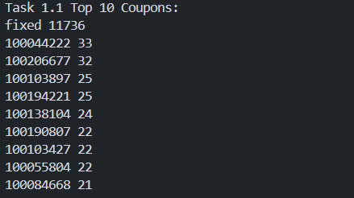
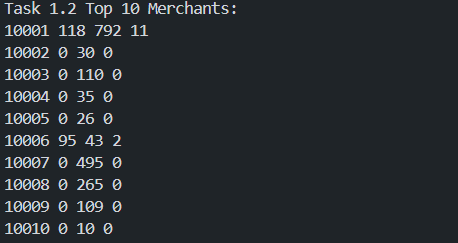
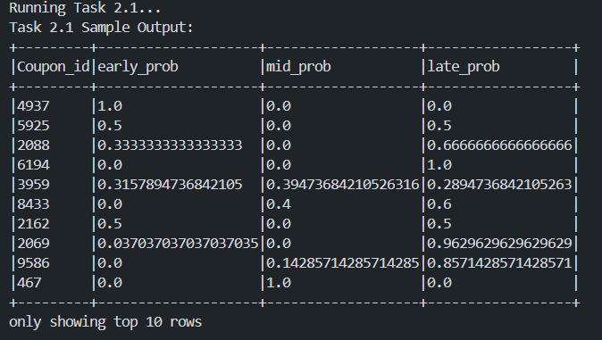
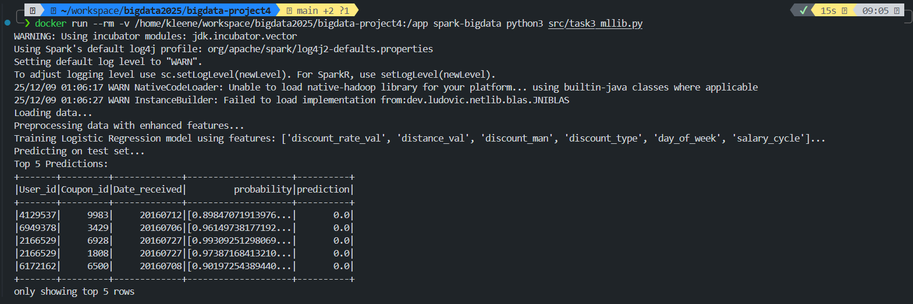

# 实验4：Spark 编程 实验报告

## 一、实验任务一：Spark RDD 编程

### 1.1 设计思路

**题目要求**：
1. 统计优惠券发放数量（按 Coupon_id 降序）。
2. 统计商家优惠券使用情况（负样本、普通消费、正样本）。

**实现逻辑**：
*   **优惠券统计**：
    *   读取 `ccf_online_stage1_train.csv`。
    *   过滤掉 `Date` 为 null 或 `Coupon_id` 为 null 的无效记录。
    *   使用 `map` 将每条记录转换为 `(Coupon_id, 1)` 的键值对。
    *   使用 `reduceByKey` 累加计数。
    *   使用 `sortBy` 按数量降序排列。
*   **商家统计**：
    *   定义映射逻辑：
        *   `Date=null & Coupon_id!=null` $\rightarrow$ 负样本 (1, 0, 0)
        *   `Date!=null & Coupon_id=null` $\rightarrow$ 普通消费 (0, 1, 0)
        *   `Date!=null & Coupon_id!=null` $\rightarrow$ 正样本 (0, 0, 1)
    *   使用 `map` 生成 `(Merchant_id, (neg, norm, pos))`。
    *   使用 `reduceByKey` 对三类指标同时聚合。
    *   按 `Merchant_id` 排序输出。

### 1.2 核心代码

```python
# 1. 优惠券发放数量统计
coupon_counts = coupon_usage_rdd.map(lambda row: (row['Coupon_id'], 1)) \
                                .reduceByKey(lambda a, b: a + b) \
                                .sortBy(lambda x: x[1], ascending=False)

# 2. 商家优惠券使用情况统计
def map_merchant_usage(row):
    merchant_id = row['Merchant_id']
    coupon_id = row['Coupon_id']
    date = row['Date']
    
    neg, norm, pos = 0, 0, 0
    
    if date == 'null' and coupon_id != 'null':
        neg = 1
    elif date != 'null' and coupon_id == 'null':
        norm = 1
    elif date != 'null' and coupon_id != 'null':
        pos = 1
        
    return (merchant_id, (neg, norm, pos))

merchant_stats = parsed_rdd.map(map_merchant_usage) \
                           .reduceByKey(lambda a, b: (a[0]+b[0], a[1]+b[1], a[2]+b[2])) \
                           .sortBy(lambda x: x[0], ascending=True)
```

### 1.3 运行结果

**1. 优惠券发放数量 Top 10**



**2. 商家优惠券使用情况 Top 10**



---

## 二、实验任务二：Spark SQL 编程

### 2.1 设计思路

**题目要求**：
1. 统计优惠券使用时间分布（上旬、中旬、下旬）。
2. 统计商家正样本比例 Top 10。

**实现逻辑**：
*   **时间分布**：
    *   读取 `ccf_offline_stage1_train.csv` 为 DataFrame。
    *   提取 `Date` 中的日期部分，利用 `when` 表达式将日期划分为 `early` (<=10), `mid` (11-20), `late` (>20)。
    *   使用 `pivot` 透视表功能，按 `Coupon_id` 分组，将 `period` 转为列进行计数。
    *   计算各阶段概率并输出。
*   **正样本比例**：
    *   读取任务一生成的 `online_consumption_table` 文本文件。
    *   解析为 DataFrame，包含 `Neg`, `Norm`, `Pos` 列。
    *   计算 `Total = Neg + Norm + Pos` 和 `Pos_Ratio = Pos / Total`。
    *   按 `Pos_Ratio` 降序排序取前 10。

### 2.2 核心代码

```python
# 1. 优惠券使用时间分布
df_categorized = df_used.withColumn("period", 
    when(col("day") <= 10, "early")
    .when(col("day") <= 20, "mid")
    .otherwise("late")
)

# Pivot 透视统计
df_counts = df_categorized.groupBy("Coupon_id") \
    .pivot("period", ["early", "mid", "late"]).count().na.fill(0)

# 2. 商家正样本比例
df_merchant = df_merchant.withColumn("Total", col("Neg") + col("Norm") + col("Pos"))
df_merchant = df_merchant.withColumn("Pos_Ratio", col("Pos") / col("Total"))
df_result_2_2 = df_merchant.orderBy(col("Pos_Ratio").desc()).limit(10)
```

### 2.3 运行结果

**1. 优惠券使用时间分布 Top 10**



**2. 商家正样本比例 Top 10**


---

## 三、实验任务三：Spark MLlib 编程

### 3.1 设计思路

**题目要求**：
*   预测用户在领取优惠券后 15 天内是否核销（二分类问题）。

**实现逻辑**：
*   **特征工程**：
    *   **折扣特征**：将 "150:20" 转换为折扣率 `1-20/150`，并提取满减门槛（如 150）和折扣类型（满减/直降）。
    *   **距离特征**：将缺失值填充为 11（大于最大距离 10），保持距离的序数性质。
    *   **时间特征**：提取领券日期的 `day_of_week`（周几）和 `salary_cycle`（发薪周期），捕捉周末和发薪日的消费规律。
*   **模型训练**：
    *   使用 `VectorAssembler` 将特征组合成向量。
    *   使用 `LogisticRegression` 进行二分类训练。
*   **预测**：
    *   对测试集进行同样的特征处理并预测，输出概率。

### 3.2 核心代码

```python
# 特征工程：折扣率计算
def calc_discount(rate):
    if rate is None or rate == 'null': return 1.0
    if ':' in rate:
        a, b = rate.split(':')
        return 1.0 - float(b)/float(a)
    return float(rate)

# 特征工程：距离处理（缺失值填 11）
df = df.withColumn("distance_val", 
    when((col("Distance") == "null") | (col("Distance").isNull()), 11)
    .otherwise(col("Distance").cast("int"))
)

# 模型训练
assembler = VectorAssembler(inputCols=feature_cols, outputCol="features")
lr = LogisticRegression(featuresCol="features", labelCol="label")
model = lr.fit(train_data)
predictions = model.transform(test_data)
```

### 3.3 运行结果

**逻辑回归预测结果 (Top 5)**



---

## 四、实验感受与收获

本次实验通过三个递进的任务，完整体验了 Spark 生态系统在实际数据分析中的应用。

1.  **RDD vs SQL vs MLlib**：
    *   **RDD** 提供了最底层的控制，非常适合处理非结构化文本或需要自定义复杂聚合逻辑的场景（如任务一中的三类样本同时统计）。
    *   **Spark SQL** 极大地简化了结构化数据的处理，`pivot` 等高级函数让多维分析变得非常直观，代码量远少于 RDD。
    *   **MLlib** 使得在分布式环境下构建机器学习流水线成为可能，特征工程与模型训练的无缝衔接提高了开发效率。

2.  **特征工程的重要性**：
    *   在任务三中，简单的模型（逻辑回归）配合有业务含义的特征（如折扣率转换、发薪周期）往往能取得不错的效果。处理缺失值（如距离）时，结合业务场景填充（填 11 而非 -1）比盲目填充均值更有效。

3.  **工程化思维**：
    *   通过 Docker 统一实验环境，避免了因依赖版本不一致导致的问题。
    *   将不同任务的输入输出解耦，使得实验流程清晰可复现。

## 附录

*   **完整代码**：请见项目 `src/` 目录下的 `task1_rdd.py`, `task2_sql.py`, `task3_mllib.py`。
*   **完整结果**：请见项目 `output/` 目录下的各任务输出文件。
